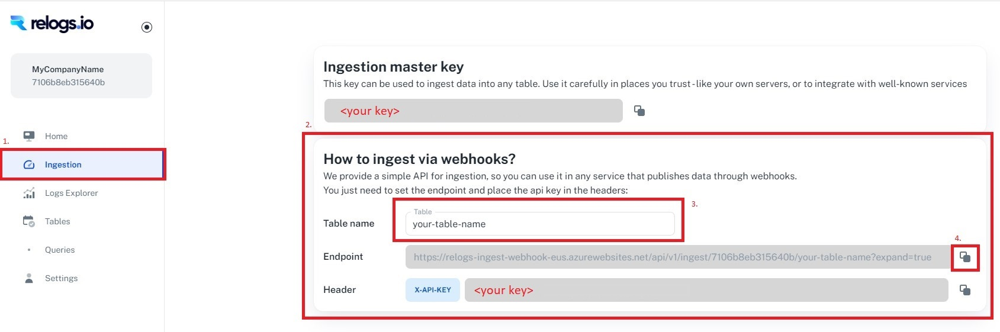

# Integrations
Relogs integrations:
- [Zappier](zappier/README.md)


## Onboarding
To onboard to Relogs.io follow this steps: 
* Get into https://app.relogs.io  
* Sign in with your Google account
* Enter your Workspace name and register  

* Wait while your workspace is being created   
   
* **That's it!**

## Account Information:
Most integrations will require webhook url or ```WorkspaceId``` + ```ApplicationKey```
* To get your Webhook url:
  1. Go to ```Ingestion``` tab
  2. Enter Table name
  3. Press on the copy button  
    

* To get your credentials:
  1. Go to ```Ingestion``` tab
  2. Copy Ingestion key
  3. Copy Workspace Id   
    
