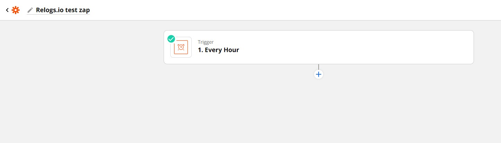
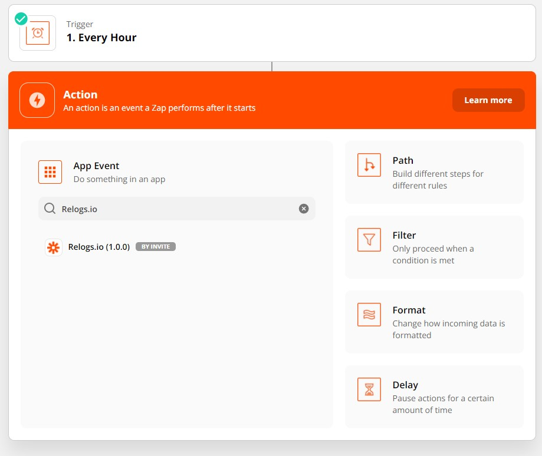
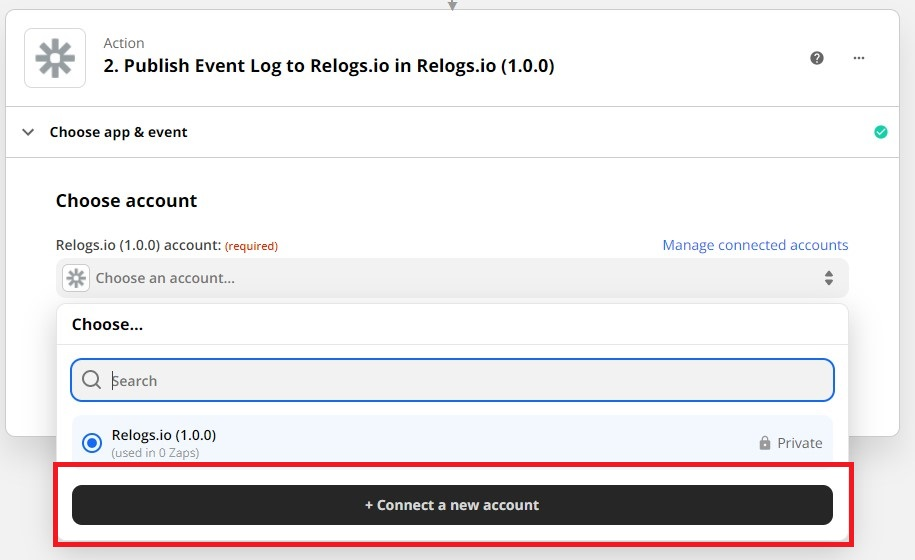
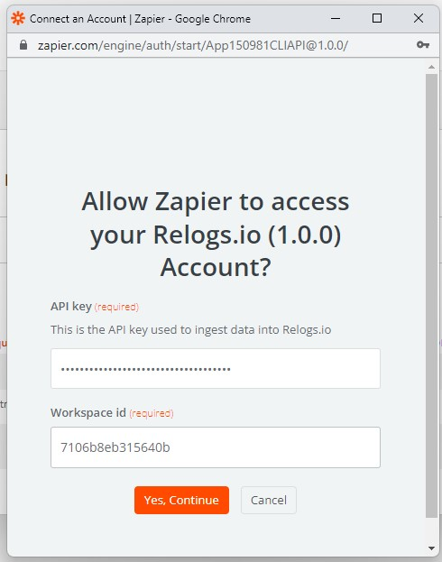
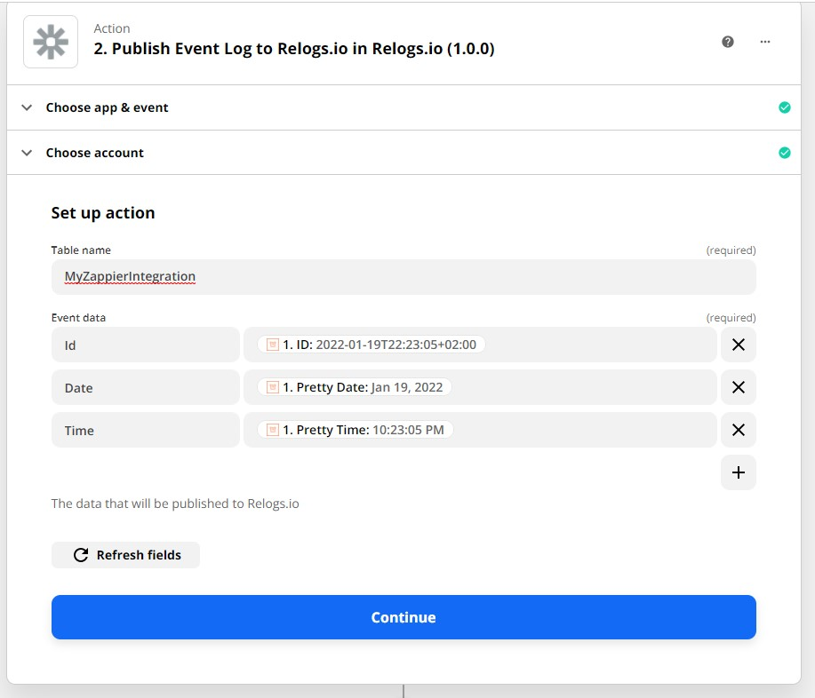
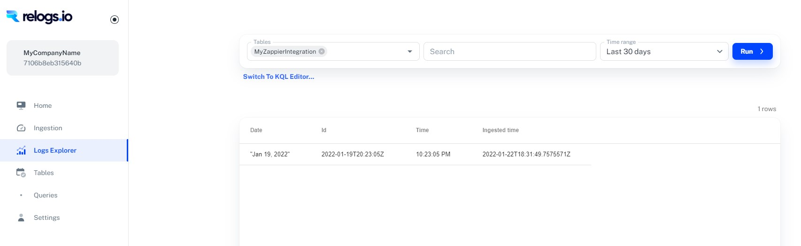

# Relogs.io Zappier integration 
This docs describes how to use Relogs.io zappier action.

## Requirements:
- [Onboard to Relogs.io](../README.md#Onboarding)
- [Get your WorkspaceId](../README.md#Account-Information)
- [Get your ApplicationKey](../README.md#Account-Information)

## Send data from Zappier to Relogs.io
* Create your own Zap with Trigger  
    

* Add new ```Relogs.io``` action  
    

* Choose ```Publish Event Log to Relogs.io``` in Action Event and press continue  

* In the Zappier Choose account step, we will connect new account with the API key and Workspace Id from the [requirements](#Requirements)

    
    

* Choose your Relogs.io table name and build your event message  
    

* Go to Relogs.io Log Explorer and get insights on your data!  
    

### **That's it!**
